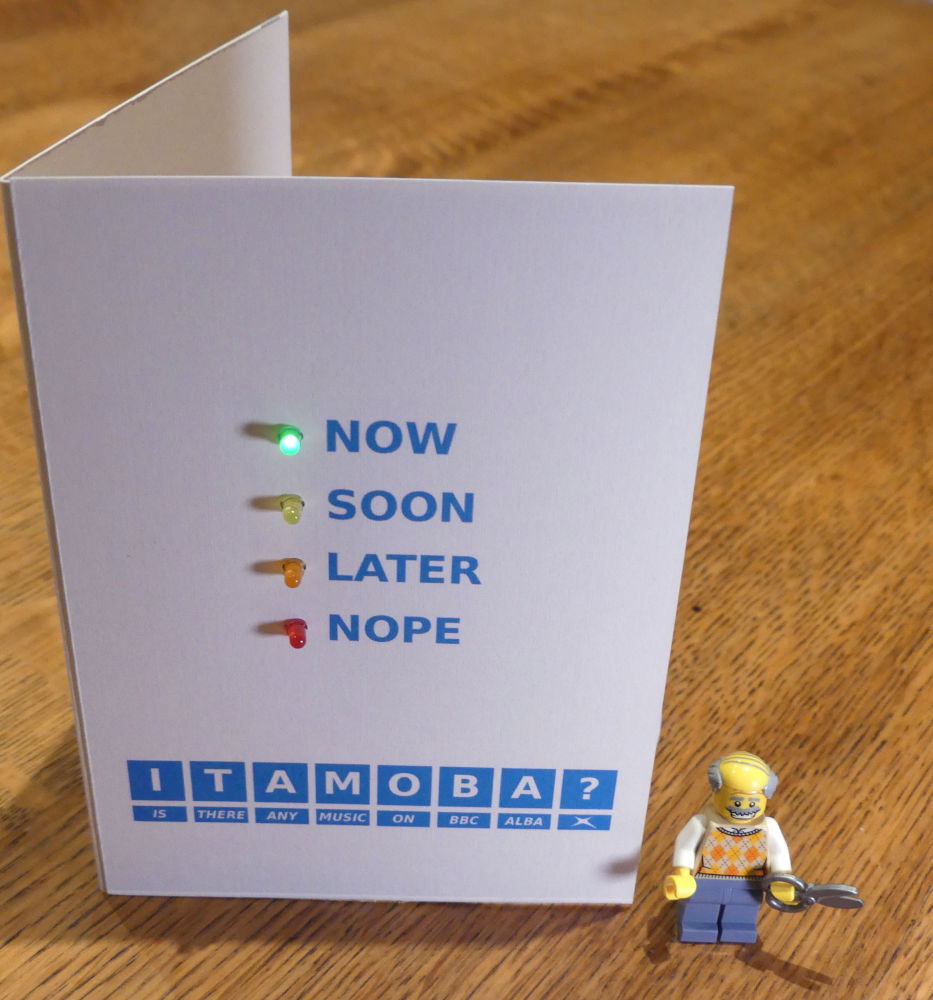
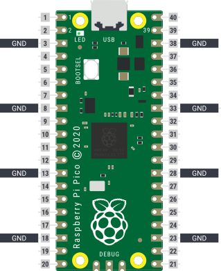
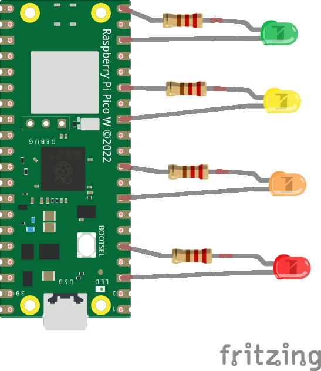
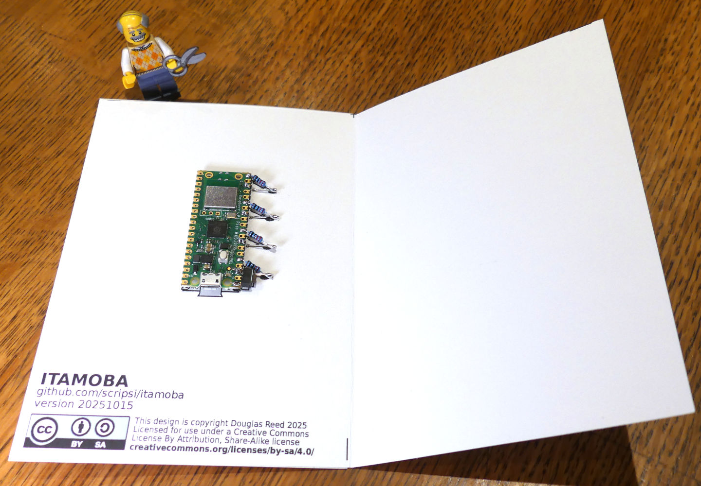
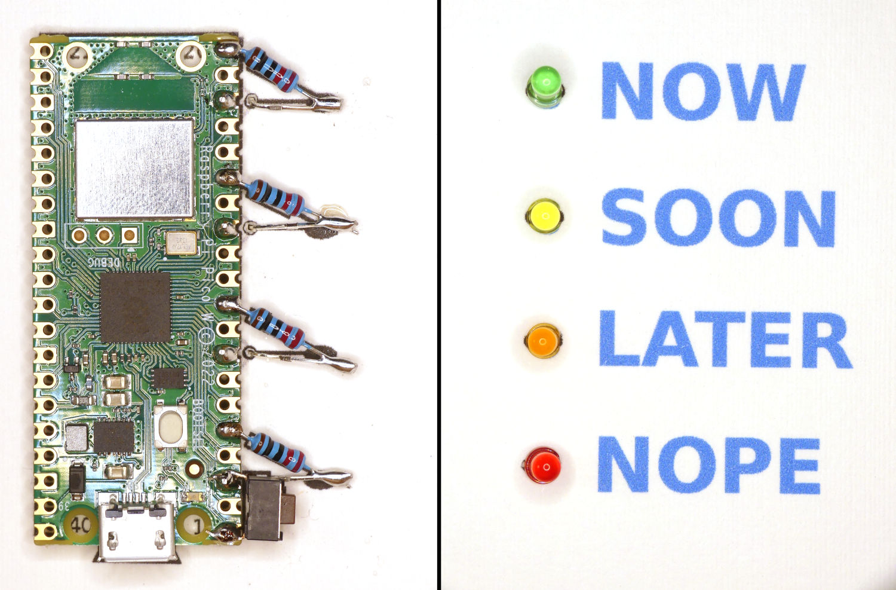

# ITAMOBA?
_"Is there any music on BBC Alba?"_



## Introduction

One of the really thoughtful design features of the [Raspberry Pi Pico series](https://www.raspberrypi.com/documentation/microcontrollers/pico-series.html) boards is the row of regularly-spaced ground pads down each side of the board:



The plentiful ground connections (shown by square-ended pads on the board) make it easy to build circuits with components wired directly to the Pico, and their regular spacing lends itself particularly to traffic-light style indicators. A Pico W with a few LEDs and resistors wired to it can make a useful and very low cost web-connected status indicator. I started to explore this with another project called [ShowBoat](https://github.com/scripsi/showboat), but that project is currently stalled, so I have been left with a solution looking for a problem.

[BBC Alba](https://www.bbc.co.uk/tv/bbcalba) is the Gaelic language TV channel here in Scotland, and it often has programmes showcasing traditional music that my wife and I both enjoy. When we can't find anything else to watch on TV, we will often ask each other "is there any music on BBC Alba?", to the point that it has now become a running joke. For my wife's birthday this year, I thought I would make a device that would answer the question definitively for us, and hence **ITAMOBA?** was born. Although this is, admittedly, pretty niche, it is still a good example project for how to make a low-cost web-connected status indicator, and it could easily be expanded or adapted for other, more general uses.

## Hardware

The very basic hardware consists of a [Raspberry Pi Pico W](https://www.raspberrypi.com/products/raspberry-pi-pico/) or [Raspberry Pi Pico 2 W](https://www.raspberrypi.com/products/raspberry-pi-pico-2/), with a handful of LEDs and resistors:



The LEDs are standard 3mm through-hole LEDs in red, orange, yellow, and green (I bought mine from [Pimoroni](https://shop.pimoroni.com/products/led-3mm-pack-of-10?variant=32754744714)), and the resistors can be any old parts that you might have lying around in the 100-300 Ohm range (i used 220 Ohm). These are soldered directly to the Raspberry Pi Pico W board [dead bug style](https://www.instructables.com/Dead-Bug-Prototyping-and-Freeform-Electronics/) with the aid of a card template.





_NOTE: The switch shown in the above picture attached between pins 1 and 3 is to enable a future feature and isn't necessary for the current version_

## Software

### Installation

The software is written in MicroPython, which requires flashing the latest version of the MicroPython firmware image to the Raspberry Pi Pico W board first ([see here for instructions](https://www.raspberrypi.com/documentation/microcontrollers/micropython.html)). Once that's done, you can upload the file `main.py` to the board using a MicroPython-aware IDE like [Thonny](https://thonny.org/) or Microsoft Visual Studio Code with the [Raspberry Pi Pico extension](https://marketplace.visualstudio.com/items?itemName=raspberry-pi.raspberry-pi-pico).

### Configuration

The software needs a configuration file to set your WiFi network details. You can either edit and upload `config.json` to the board, or you can use the MicroPython REPL to create the config file directly:

```Python
>>> import json
>>> config={'wifissid':'my-wifi-network-name','wifipass':'my-wifi-password'}
>>> f = open('config.json', 'w')
>>> f.write(json.dumps(config))
>>> f.close()
```

## How it works

When you plug the Raspberry Pi Pico W into a USB power supply, the `main.py` script runs automatically. It starts by reading the config file and attempting to connect to the WiFi network. Once connected, it then uses NTP to update the board's real-time clock (RTC) to the correct time in UTC format. The script then enters a continuous loop, downloading and parsing the BBC schedule page at regular intervals and using that information to update the LEDs to show when the next music programme will be on.

## Adventures with web-scraping on a microprocessor

### What no API?

You'd think that a public-service broadcaster like the BBC would have a nice open-access API for reading its programme schedule, and indeed it [used to have one](https://www.bbc.co.uk/developer/technology/apis.html), but sadly not any more. Instead, I had to hunt for the information I needed from the regular schedule pages on the BBC website. Fortunately, these have quite a simple URL scheme to identify the correct channel and date:

```
https://www.bbc.co.uk/iplayer/guide/[channelname]/[YYYYMMDD]
```

If you download a page using that URL scheme, you get a very large (>320kB!) HTML file that contains almost no plain text in the body of the page. Instead, it is full of scripts and large amounts of cryptic SVG image descriptions. The schedule that you see when you view the page in a browser seems to be constructed by the scripts once the page has loaded.

### Finding the needle in the haystack

There is simply no way that the tiny microprocessor and memory on the Raspberry Pi Pico W can cope with downloading, processing and running JavaScript on such a large and complex page. I thought I was stuck, until I did a search for likely programme names on the whole of the HTML file and found that the schedule is contained in JSON data in a script tag in the `<head>` section:

```html
<script id="tvip-script-app-store">window.__IPLAYER_REDUX_STATE__ = {"navigation"...
```

```json
{"navigation":...,
 "page":...,
 "schedule":
   {"items":
     [{"type":"LIVE",
       "props":{
         ...
         "label":"Entertainment",
         "title":"Alba Today",
         ...
       },
       "meta":{
         "scheduledStart":"2025-10-20T05:00:00.000Z",
         "scheduledEnd":"2025-10-20T16:00:00.000Z"
       }
      },
      ...
      {"type":"AVAILABLE_FUTURE",
       "props":{
         ...
         "label":"Music",
         "title":"Belladrum",
         ...
       "meta":{
         "scheduledStart":"2025-10-20T22:40:00.000Z",
         "scheduledEnd":"2025-10-20T23:00:00.000Z"}
       }
      },
     ...
    ]
  }
}
```

In the excerpt of the data above, the important points are that:

- the "schedule" section contains an array of items representing programmes
- each item has a "label" showing what type of programme it is (including a useful "Music" category)
- each item has a scheduled start and end time in UTC format (so no need to worry about daylight savings, timezones etc)

This data provides everything needed to answer the question "Is there any music on BBC Alba?"

### Digesting the data

The meagre 264kB of memory on the Raspberry Pi Pico W can't cope with downloading and parsing the web page in one go. Instead, the script streams the page in chunks into a buffer and searches the buffer for the script ID "tvip-script-app-store". It then reads the buffer forward until it reaches the "schedule" array and reads that into a JSON object. Once the schedule data has been read, the rest of the streamed web page can be ignored.

### Perpetual vigilance

Web-scraping is a risky occupation - minor changes in the labelling of web page elements or data items could cause the script to fail. Also, having to stream and buffer such a large web page to search for items creates a small risk that changes in page design and content will cause a search phrase to be split across a buffer boundary and be missed (though maybe that can be solved with better code). I have no idea how long this script will keep working or how often I'll have to update it, which is not ideal. A stable, well-documented JSON API for programme data would be _so much better_. 

**Are you listening BBC?**

## What next?

ITAMOBA? is now installed beneath our TV and working well, but I'm not done yet. I can think of plenty of ways to improve the basic idea, which I hope to keep working on:

- Make the project more generic: _Is there any [programme category] on BBC[channel]?_
- Enable searching for keywords in TV programme titles for use in allow-lists or block-lists
- More graceful error-handling, using the LEDs to show permanent and temporary error conditions
- Add web-based captive-portal WiFi configuration based on Pimoroni's [Phew library](https://github.com/pimoroni/phew) or similar
